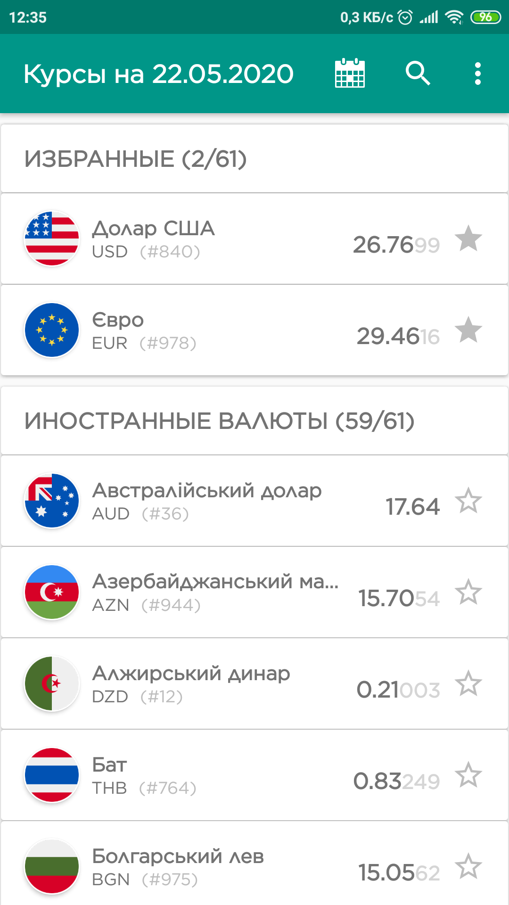
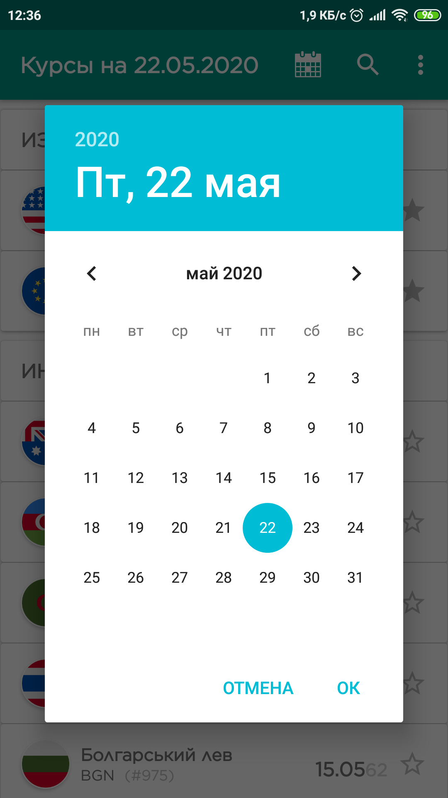
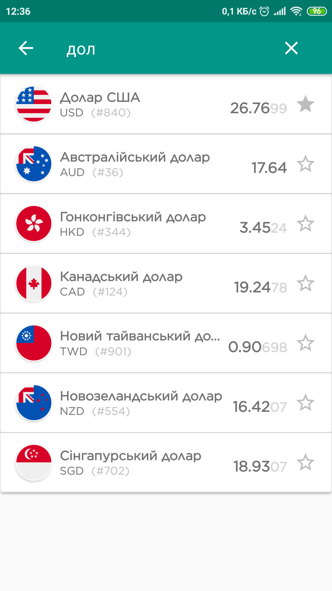

<h1>Official Hryvnia Rate</h1>
<h2>Официальный курс гривны.</h2>

Предоставление курса гривны на сегодняшний день и за прошедший период.

Отображение курса гривны по отношению к иностранным валютам и банковских металлов на основании данных, предоставляемых сервисом API НБУ.

<table width="100%" border=0 cellpadding=0 cellspacing=0>
  <tr>
    <td>
      
    </td>
    <td>
      
    </td>
    <td>
      
    </td>
  </tr>
</table>
